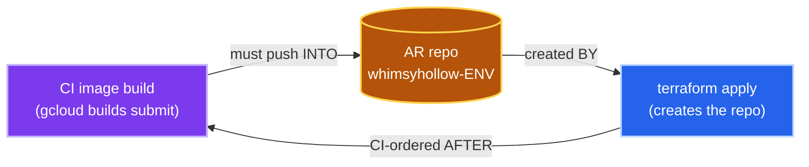
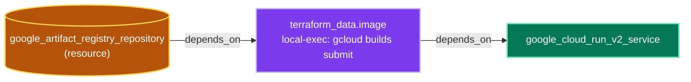

# Retro: the Terraform ↔ Artifact Registry "chicken-and-egg"

**Root cause (one line):** the container-image build was a **CI shell step *outside*
terraform's dependency graph**, so the "repo before build before service" ordering was
enforced implicitly — and on a clean slate that implicit ordering was simply wrong.
There was never a real cycle; there was a **missing edge in the DAG**.

## The apparent cycle

The build needs a repo that `terraform apply` only creates *later* — but the build is
sequenced by the **CI YAML**, not terraform, so terraform can't help. In a long-lived
project (and in the `agentic-webapp` scaffold) the repo already existed, so the bad
ordering never bit — the defect was **latent, masked by pre-existing repos + pinned
image tags**, not absent. whimsyhollow's clean-slate first deploys exposed it.

## The fix: make the build a first-class node in the DAG

Model the build as a terraform resource that **`depends_on` the repo**; Cloud Run
`depends_on` the build. Terraform now computes the order itself — one `apply` from
empty. (Same idea as AWS Lambda's `terraform_data`/`source_code_hash` zip-and-upload.)

Acyclic: `repo → build(push) → service`. See `infra/stacks/webapp/build.tf` +
`artifact_registry.tf` + `cloudrun.tf`. The image is tagged by a hash of the app
source (`local.app_src_hash`), so the build re-runs and Cloud Run gets a new revision
only on a real code change. Cloud Build does the Docker build remotely, so the apply
host needs gcloud + creds but no Docker daemon.

## Notes

- **Phased rollout would also have worked** (Q from the discussion): a first pass that
  created the repos with *no* build (hello image) across all envs, then later PRs
  layering the real-image build, avoids the empty-repo case — exactly the
  `v0.1.0` (hello) → `v0.2.0` (real) path that succeeded. But it relies on deploy
  *ordering*; the in-DAG build removes that dependency entirely.
- **Superseded interim fix:** an earlier change moved the repo into `bootstrap` (so it
  pre-existed) — valid, but it solved a *layering* symptom by relocating the resource
  rather than fixing the *missing DAG edge*. The in-DAG build lets the repo live back
  in the stack where it belongs.

## Lessons

1. A resource consumed *as an input to a build* must be sequenced by terraform — model
   the build **in the graph**, don't order it by hand in CI YAML.
2. "It works in the reference repo" can mean the failure mode is **masked** there, not
   absent. Exercise the clean-slate first-run path explicitly.
3. CI drives terraform only through the curated `tfs` CLI — no hand-rolled `-target` /
   saved plans — so plan and apply never diverge.
