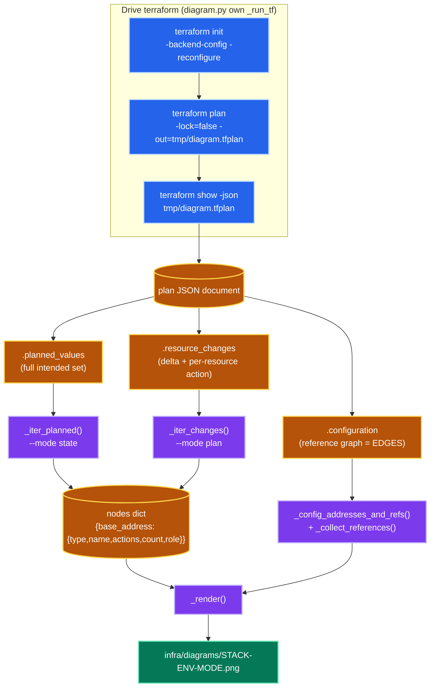
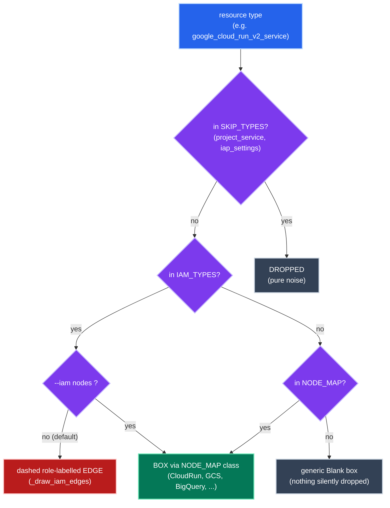
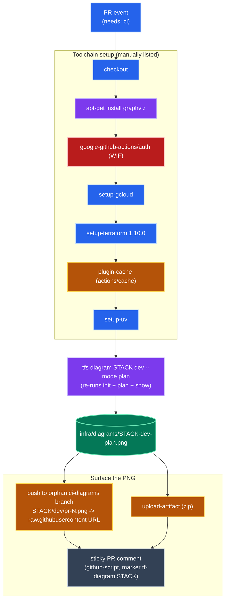
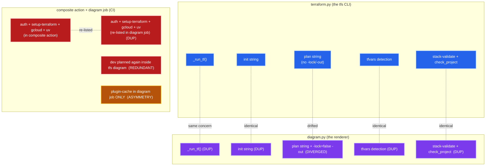

# Inventory: the Terraform diagram-generation machinery

A meticulous walkthrough of the code that **renders architecture diagrams from
Terraform**, ahead of refining/extending it. Two surfaces:

1. **`infra/tfs/src/tfs/commands/diagram.py`** — the `tfs diagram <stack> <env>`
   command: runs a throwaway plan, parses the plan JSON, and renders a
   mingrammer `diagrams` PNG.
2. **`.github/workflows/terraform-cicd-per-stack.yml:124-226`** — the CI
   `diagram` job: runs `tfs diagram … dev --mode plan` on every PR, publishes the
   PNG, and posts it as a sticky PR comment.

The goal of this doc is an honest **inventory of the current state** — what each
piece does, how the data flows, and **where concerns are accidentally
duplicated** — so the next extension starts from a clean map.

> Palette/edge conventions are the same as the companion retro
> [`tf-ar-cyclic-dependency.md`](./tf-ar-cyclic-dependency.md): hue = category,
> solid arrow = data/control flow, dashed = a derived/secondary relationship.

---

## 1. `tfs diagram` — the data pipeline

The command is a straight-line pipeline: **plan → JSON → parse → classify →
render**. The one document `terraform show -json <plan>` emits carries three
independent sections, and the code reads different sections depending on
`--mode`.

**Why a plan and not bare state?** `terraform show -json` of bare state omits
`.configuration`, which is the *only* section carrying the reference graph (the
edges). So the command always plans — even in `--mode state` — purely to obtain
edges. `-lock=false` makes the plan a read-only throwaway that won't race the
real `plan`/`apply` jobs for the GCS state lock.

**The two modes differ only in which section populates `nodes`:**

| Mode | Source section | Iterator | What a node carries |
|------|----------------|----------|---------------------|
| `state` (default) | `.planned_values` | `_iter_planned()` | the full intended resource set; `role` from `values` |
| `plan` | `.resource_changes` | `_iter_changes()` | only changed resources; `actions` tuple + `role` from `after` |

Both iterators walk `child_modules` recursively, skip `mode == "data"` (data
sources), and collapse `for_each`/`count` instances to one node via
`_base_address()` (strips the `["k"]` / `[0]` suffix), counting the collapsed
instances in `count` (rendered as `name xN`).

---

## 2. Classification — type → node, edge, or drop

Once resources are collected, each Terraform *type* is routed three ways. This is
the single most editable part of the design (the registries are module-level
dicts/sets), and it's where the diagram's "signal vs. noise" policy lives.

| Registry | Role | Members (today) |
|----------|------|-----------------|
| `NODE_MAP` | type → (diagrams node class, cluster label) | Cloud Run, Compute Engine, SA, IAP identity, GCS, BQ dataset+table, AR repo, Cloud Build trigger |
| `IAM_TYPES` | render as edges, not boxes (unless `--iam nodes`) | the 7 `*_iam_member` types |
| `SKIP_TYPES` | drop entirely | `google_project_service`, `google_iap_settings` |
| (fallback) | `generic.blank.Blank`, cluster "Other" | any unmapped type |

**Edge construction** (in `_render`): for every `(src, ref)` pair, `ref` is
resolved to the **longest managed-resource address it starts with**
(`_resolve_reference` — so `google_service_account.runtime.email` resolves to
`google_service_account.runtime`). A solid grey edge is drawn when both ends are
boxes, deduped via a `seen` set. **IAM edges** are special-cased
(`_draw_iam_edges`): an `*_iam_member` resource's references are split into
*members* (service-account targets) and *targets* (everything else), then a
dashed edge `member -> target` is drawn, labelled with the role (`roles/`
stripped). In `--mode plan`, `_make_node` prefixes the label with an action
glyph and colours the font; `_legend()` adds a legend cluster.

| Plan action | Glyph | Colour |
|-------------|-------|--------|
| create | `+` | `#16a34a` (green) |
| update | `~` | `#d97706` (amber) |
| replace (create+delete) | `±` | `#7c3aed` (violet) |
| delete | `-` | `#dc2626` (red) |
| no-op / read | (none) | `#64748b` (slate) |

---

## 3. The CI `diagram` job (lines 124-226)

On every PR, a dedicated job renders the **dev plan-delta** diagram and surfaces
it as a sticky comment. It is informational — `needs: ci` only, and **no
apply job depends on it**, so it never gates a deploy.

**Why the orphan `ci-diagrams` branch?** A GitHub artifact is a zip — you can't
`` it inline. So the job clones (or creates) an orphan `ci-diagrams`
branch, commits the PNG at `STACK/dev/pr-N.png`, and embeds the
`raw.githubusercontent.com/…/ci-diagrams/…` URL (cache-busted with `?v=SHA`) in
the comment. The artifact upload is kept as the download link. The comment is
made sticky by finding an existing comment containing the
`<!-- tf-diagram:STACK -->` marker and updating it in place.

**Notable scoping choices:** the job is hardwired to **`dev`** (`environment:
dev` + literal `dev` in the render command), so the delta only ever reflects the
dev plan, never test/prod. It needs `contents: write` (to push the branch) on top
of the usual `id-token: write` + `pull-requests: write`.

---

## 4. Duplication inventory

This is the core of the inventory: where the same concern is implemented more
than once. The map below shows the **three surfaces that each independently know
how to drive terraform**, and the concerns that overlap between them.

### Findings (ranked by drift risk)

| # | Finding | Where | Why it matters |
|---|---------|-------|----------------|
| **D1** | **`plan` command divergence** | `terraform.py:44` vs `diagram.py:180` | Two hand-built `terraform plan` strings. The diagram one adds `-lock=false -out=…`; they otherwise overlap. The whole point of the curated CLI is "plan and apply never diverge" — the diagram path silently sits *outside* that guarantee. If `tfs plan` gains a flag (a new `-var`, a backend tweak), the diagram won't get it. |
| **D2** | **Second `_run_tf` implementation** | `terraform.py:22` + `diagram.py:97` | Same concern (run terraform via `subprocess`, `cwd=infra_root`) implemented twice with different signatures. The diagram one is a thinner raw-args variant. |
| **D3** | **`init` string duplicated** | `terraform.py:42` + `diagram.py:175` | Identical `init -backend-config=./backends/<env>.config -reconfigure`. Two copies of the backend-wiring convention. |
| **D4** | **tfvars-detection duplicated** | `terraform.py:38-39` + `diagram.py:170-171` | The `"<env>.tfvars" exists ? -var-file=… : ""` logic is copy-pasted. |
| **D5** | **Handler preamble duplicated** | `terraform.py:68-72` + `diagram.py:165-167` | `stack in list_stacks(...)` validation + `check_project(env)` repeated per command (also in `create`/`validate`). A candidate for a shared decorator/helper. |
| **D6** | **CI toolchain setup re-listed** | `actions/terraform/action.yml:58-76` vs job `144-161` | `auth (WIF) + setup-terraform + setup-gcloud + setup-uv` appears in the composite action *and* is hand-repeated in the diagram job, because the composite only supports `plan`/`apply`, not `diagram`. |
| **D7** | **`dev` planned twice per PR** | `plan/dev` matrix job + `tfs diagram … dev` | The diagram command re-runs `init`+`plan` for dev, which the `plan` matrix job already did. Redundant cloud round-trip + state read on every PR. |
| **D8** | **Plugin cache asymmetry** | diagram job `151-157` only | Only the diagram job caches `TF_PLUGIN_CACHE_DIR`; the composite action (plan/apply) re-downloads providers each run. Not duplication — an *inconsistency* worth leveling. |
| **D9** | **Stale comment** | `plan` job env `99-101` | A comment about planning "against the image this commit WOULD deploy" / a `container_image` TF_VAR that is no longer set (the build moved in-DAG). Orphaned narrative. |

### Refactor seams (for when you extend it)

These are *seams*, not prescriptions — you mentioned having your own direction:

- **D1-D4 collapse into one shared terraform-driver.** A small
  `tfs/_terraform.py` (or methods on a `Stack` object) owning
  `init()` / `plan(*, lock, out)` / `tfvars_flag()` would let `diagram.py` call
  the same builder the CLI uses, so the diagram plan can never drift from the
  real plan. `diagram`'s only real extra is `-lock=false -out=`.
- **D6 collapse:** either teach the `.github/actions/terraform` composite a
  third `action: diagram`, or extract a `setup-tf-toolchain` composite that both
  the terraform action and the diagram job `uses:`.
- **D7:** if the `plan/dev` job wrote its plan JSON as an artifact, the diagram
  job could render from that artifact instead of re-planning — removing the
  second dev plan entirely (and incidentally making the diagram reflect the
  *exact* plan that gated, not a fresh one).

---

## 5. File / line cross-reference

| Symbol | Location | Role |
|--------|----------|------|
| `cmd_diagram` | `diagram.py:163` | entry point: plan → parse → `_render` |
| `_run_tf` | `diagram.py:97` | thin terraform subprocess wrapper (cf. `terraform.py:22`) |
| `_iter_planned` / `_iter_changes` | `diagram.py:130` / `142` | section walkers for `--mode state` / `plan` |
| `_config_addresses_and_refs` / `_collect_references` / `_resolve_reference` | `diagram.py:156` / `104` / `119` | the edge (reference-graph) extraction |
| `NODE_MAP` / `IAM_TYPES` / `SKIP_TYPES` / `ACTION_STYLE` | `diagram.py:49` / `62` / `73` / `76` | the classification registries |
| `_render` / `_make_node` / `_draw_iam_edges` / `_legend` | `diagram.py:228` / `267` / `278` / `299` | mingrammer rendering |
| `diagram` job | `terraform-cicd-per-stack.yml:124-226` | CI: render dev plan delta + sticky PR comment |
| composite action | `.github/actions/terraform/action.yml` | the `plan`/`apply` driver the diagram job parallels |
