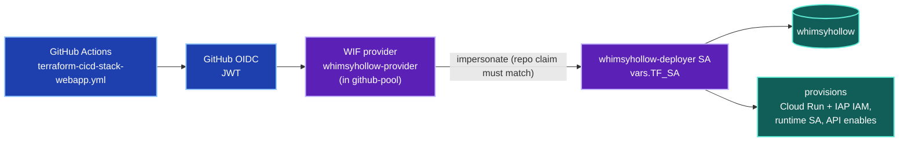

# Authentication & Authorization

How identities are established and what they may touch in the **whimsyhollow**
infra. Two distinct principals, both authenticating with **zero long-lived
keyfiles**:

- **TF Deployer** — the `whimsyhollow-deployer` SA that *provisions* the
  `webapp` stack. Reached only via GitHub OIDC → Workload Identity Federation.
- **IAP Human** — the Google identities in `var.iap_members` that *use* the
  deployed Cloud Run service through Identity-Aware Proxy.

These map to the two halves of the system: the deployer builds the service; IAP
governs who may then reach it.

---

## Lens 1 — TF Deployer (provisioning)

A GitHub-signed OIDC JWT is exchanged at this repo's WIF provider (gated on
`attribute.repository == neozenith/whimsyhollow`), yielding a federated token
that impersonates `whimsyhollow-deployer`, which runs `plan`/`apply`.

The dual WIF gate (OIDC provider's repo condition **and** the SA's `principalSet`
binding) is what establishes trust: only a workflow from `neozenith/whimsyhollow`
can impersonate the single `whimsyhollow-deployer`. The three GitHub Environments
(dev/test/prod) all point at the same `WIF_PROVIDER` + `TF_SA`; per-env isolation
comes from GitHub Environment protection rules (e.g. prod required reviewers) plus
the per-env terraform state prefix. See [`bootstrap/README.md`](./bootstrap/README.md).

---

## Lens 2 — IAP Human (using the service)

Every request to the Cloud Run `run.app` URL is intercepted by IAP. Access is a
two-hop chain — the user is admitted by IAP, then IAP (as its service agent)
invokes Cloud Run.

```mermaid
flowchart LR
    user["Authorized user<br/>(IAP_MEMBERS secret)"]:::ingress
    iap["Identity-Aware Proxy"]:::compute
    agent["IAP service agent<br/>service-NUM@gcp-sa-iap"]:::compute
    run["Cloud Run<br/>whimsyhollow-&lt;env&gt; (min=0)"]:::data
    app["Container<br/>(runs as runtime SA)"]:::data

    user -->|"roles/iap.httpsResourceAccessor"| iap
    iap -->|"as agent"| agent
    agent -->|"roles/run.invoker"| run
    run --> app

    classDef ingress  fill:#1e40af,stroke:#93c5fd,color:#fff,stroke-width:2px
    classDef compute  fill:#5b21b6,stroke:#c4b5fd,color:#fff,stroke-width:2px
    classDef data     fill:#115e59,stroke:#5eead4,color:#fff,stroke-width:2px
```

*Three identities, one request:* the **human** (admitted by IAP), the **IAP
service agent** (invokes Cloud Run), and the **runtime SA** (what the container
executes as). Removing a user from `var.iap_members` revokes their access at the
outer hop without touching the service.

---

## Why no keyfiles anywhere

| Path | GitHub-side gate | GCP-side gate |
|------|------------------|---------------|
| TF Deployer | `terraform-cicd-stack-webapp.yml` env + `id-token: write` | WIF `attribute.repository == neozenith/whimsyhollow` + `whimsyhollow-deployer` `workloadIdentityUser` binding |
| IAP Human | — (Google sign-in at the IAP consent screen) | `roles/iap.httpsResourceAccessor` on the IAP resource, for `var.iap_members` only |

Both halves fail **closed**: a workflow from any other repo can't impersonate the
deployer (repo claim mismatch), and any Google account not in `iap_members` is
rejected by IAP before a single request reaches the container.
